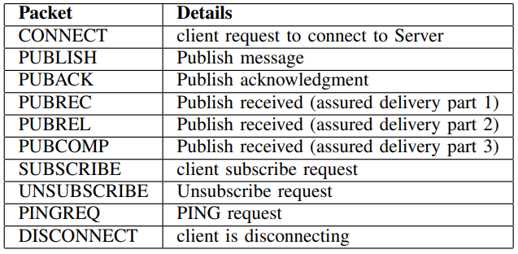
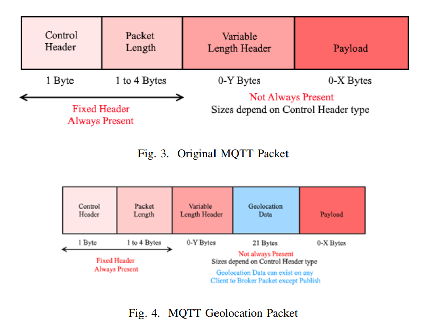

# MQTT-Q: A Publish-Subscribe Protocol with Geolocation

## Abstract
- Message Queue Transport Telemetry (MQTT) is an open source Publish-Subscribe standard for M2M communication.
- It is also suitable for IoT messaging situations where power usage is at a premium.

## Intro
- MQTT is a Client/Server messaging transport protocol.
- It is lightweight and easy to implement on both sides.
- Fits perfectly for the devices with limited resources.

## History
- Invented by Andy Stanford-Clark (IBM) and Arlen Nipper (Arcom) in 1999.

## Goals
- Easy to implement;
- Provide QoS Data Delivery;
- Lightweight and Bandwidth Efficient;
- Data Agnostic;
- Continuous Session Awareness;

## Implementation

### Mosquitto
- It provides standard compliant server and client implementations.
- An MQTT client library written in C/C++ wrapper.

## Publish/Subscribe Pattern
- A client publishes some information.
- Other clients can subscribe to receive relevant data.
- A broker can be used to decouple the client sides.
- There are 3 types of decoupling:
  - Space: The clients don't need to know the IP address of each other.
  - Time: The clients don't have to run at the same time.
  - Synchronization: Publishing and receiving operations are synchronized.
- The broker has the ability to filter the messages based on the type, subject or content.

## Alternatives
- HyperText Transfer Protocol (HTTP):
  - Synchronized protocol;
- Constrained Application Protocol (CoAP);
- CloUd based PUblish/Subscribe (CUPUS):
  - More appropriate for mobile environments with frequent context changes, while it can filter out unrequired data on devices prior to being reported to backend cloud servers. 
  - The MQTT protocol proves to be suitable for Wireless Sensor Networks (WSNs) and heterogeneous environments due to its small code footprint, low bandwidth usage and standardized interfaces.

## MQTT-G
- Adding Geolocation information in MQTT packets would be possible by leveraging unused binary data in the protocol definition.
- The packets will include a Geolocation flag that will let the broker know of the presence of geolocation data.
- With exception to PUBLISH packet (which uses the 3rd bit for QoS indicators), the 3rd bit of the fixed header is not used. It can be used to indicate the presence of geolocation data.

### MQTT Packets



### MQTT Packets that don't need geolocation data
- CONNACK;
- SUBACK;
- UNSUBACK;
- PINGRESP;


### The mosquitto_location struct
```
struct mosquitto_location {
    uint8_t version;
    double lat;
    double lon;
    flot elev;
};
```

### Modified MQTT Packet



